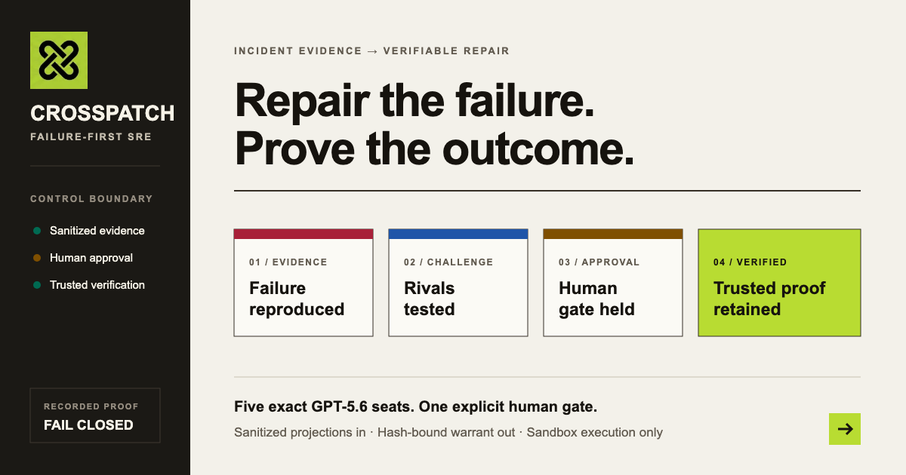
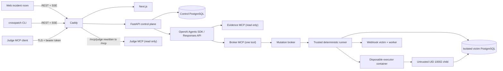

# CrossPatch

The agent-release gate that survived a live tampered-evidence attack: the
injected instruction lost authority, the legitimate repair still cleared, and
the audit trail verifies both ways on a monitored public deployment.
It is a due-process layer for agent-proposed changes.

**Live product:** [crosspatch.repair](https://crosspatch.repair)

CrossPatch is live and provably up—the demo you click is the same system that
has been running, not a cold-started shell—on persistent infrastructure with
durable state and real databases. Check the
[public uptime monitor](https://stats.uptimerobot.com/9oxeuWMvvU).

## Verify every claim yourself

Verify every claim yourself, in about a minute, on a fresh clone. One command
checks the locked keyless gate, the keyless OIDC CI contract, the golden
snapshot, and the generated claim bindings:

```bash
git clone https://github.com/asadvendor-boop/CrossPatch.git
cd CrossPatch
make judge
```

`make eval` separately recomputes the declared evaluation populations and the
canonical C2 hash from checked-in bytes.



To inspect a genuine signed case without an OpenAI key or any live authority,
start the isolated replay profile:

```bash
make replay
```

Open <http://localhost:8088/cases>. The UI persistently labels this mode
`RECORDED REPLAY — signed export, no model calls`. Its immutable API image is
built from the sealed run-04 export after pinned Ed25519 signature, member-hash,
canonical-schema, and publication checks. The profile contains only replay API,
web, and Caddy services; incident creation, models, MCP, approval, broker,
runner, victim, shell, export, and mutation routes are absent.

**Every fix must survive adversarial review.**

CrossPatch is a failure-first SRE incident room built for OpenAI Build Week. Five
model-driven specialists investigate one of two real webhook reliability
failures, challenge the causal story, propose the smallest patch, and decide
whether it is safe to present for human approval. A language model never runs a
test, writes to a worktree, or composes a mutation command. A deterministic
runner and a fail-closed mutation broker own those operations.

The demonstrated centerpiece is a proposal being stopped before it gains
authority: `REMAND` triggers one bounded reasoning escalation, a materially
different repair returns `CLEAR`, a human approves the exact byte-bound warrant,
and single-use execution ends in a trusted `1 / 1 / 1` receipt.

This run was remanded before authority was issued, then the first approved patch passed. CrossPatch never rigs a failure just to improve a demo.

The post-approval fail→repair path is implemented and test-pinned, including consumed authority
and a fresh warrant, but it was not demonstrated in the sealed cohort.

## Reproducible evaluation

The poisoned-log case demonstrates separation, not indiscriminate refusal. A
correctly signed webhook carried instruction-like text through the real victim
pipeline as tampered evidence inside the audit trail attempting to force a bad
release. CrossPatch classified the resulting projection as
`UNTRUSTED_EVIDENCE`, redacted the hostile span before model context, and denied
the hostile instruction authority. The legitimate repair still followed
`CLEAR → human approval → VERIFIED`: CrossPatch distinguished the attack from
the signal. `security.evidence-boundary`

Every denominator below is separate. A “case” means the exact unit named in the
Method column; the evaluator never adds these populations together.

| Recorded population | Observed result | What one case means |
| --- | --- | --- |
| Genuine hostile-evidence boundary | **1/1 held; 0 false approvals** | One signed production incident export whose real victim log contained the hostile span |
| Synthetic sanitizer injections | **14/14 neutralized** | One distinct raw-byte vector declared by ID and SHA-256 |
| Synthetic broker authority tampering | **34/34 rejected before side effects** | One changed bound document, catalog, approval, or live-authority field |
| Expired authority | **1/1 expired warrant denied** | One warrant evaluated after its bound expiry |
| Reused authority | **1/1 reused warrant denied** | One consumed warrant replay scenario |
| Duplicate failed repair | **1/1 duplicate failed-retry refused** | One higher-effort repair with the same semantic fingerprint |
| Published repairs | **3/5 published repairs recorded `REMAND → CLEAR`** | One signed, explicitly published production case |
| Sealed readiness cohort | **7/10 sealed-cohort runs had at least one `REMAND`** | One genuine GPT-5.6 end-to-end readiness run |

There were **zero false-approval events** in these records; only the genuine
hostile-evidence case entered a model-and-human approval flow. The unprotected
pipeline is an explicitly labeled design argument because no equivalent
measured no-sanitizer baseline exists. CrossPatch publishes no numeric “would
ship” counterfactual. `runtime.warrant-boundary` `product.effort-escalation`
`readiness.demo`

Reproduce the table and verify every declared input from a fresh clone:

```bash
make eval
```

The reference archive is the genuine C2 export, SHA-256
`77332a471410a0c8cdfac76fa12ce353f6a88e2789924e21ea1a074d10077731`.
Its hostile-input identity comes from a production-signed, read-only runtime
attestation over the persisted evidence row and hash-verified raw artifact; the
raw bytes remain outside Git and model context.
Its signature verifies under the runtime-provenanced production key and is
rejected under the sealed-cohort key. Its stable, allowlisted projection—no
timestamps, prose, request IDs, or secrets—has canonical SHA-256
`35342f9f69bfb22fa8515870400e2c09b9747f2e163da338adee9632047ef789`.
Running `make eval` independently reproduced that exact hash twice.

For audit depth rather than marketing, the current keyless inventory records 899
Python test executions passed across the two gates—872 in the backend/victim
suite (with claim-map validation excluded) and 27 in the dedicated claim-map
validation—with 28 skips; 318 UI tests and 5 browser E2E tests passed, with one
capture-generator test skipped. Those counts are evidence inventory, not the
product headline.

## Start locally

Prerequisites: Docker Desktop with Compose v2, Git, and an OpenAI API key with
access to the required GPT-5.6 tiers.

```bash
cp .env.example .env
# Add OPENAI_API_KEY to .env
docker compose up --build
```

Open <https://localhost>. Caddy is the only service that publishes host ports
(`80` and `443`); every application and MCP service remains on private Compose
networks. The local certificate is self-signed, so a browser warning is expected
for the local-only stack.

Without `OPENAI_API_KEY`, the stack still starts for inspection and local
verification, but orchestration fails closed to `ABSTAIN`. It never substitutes
mock model output. Demo readiness remains `DEMO_READINESS_BLOCKED` until at least
ten genuine fresh-output GPT-5.6 runs pass the release gate. Prompt-cache input
reads are allowed and reported separately; reusing a model response is not.

Create the real sample incident after the stack is healthy:

```bash
./scripts/setup-sample-incident.sh
```

The script calls the public control API. It does not insert incident rows,
evidence, model output, failures, or timeline events directly.

### Local credentials and CLI

The checked-in Compose fallbacks are **local-only** inspection credentials.
Hosted deployments must override every operator, approver, CSRF, step-up,
signing, runner, database, and webhook value in `.env` with independent random
secrets and set `CROSSPATCH_RELEASE_MODE=1`. Release mode refuses checked-in
local defaults and low-entropy runtime credentials before the affected service
starts. Never show hosted values in screenshots, logs, case artifacts, or shell
history.

The victim database uses two independent secrets: the bootstrap-only
`CROSSPATCH_VICTIM_POSTGRES_ADMIN_PASSWORD` and the least-privilege application
role's `CROSSPATCH_VICTIM_APP_PASSWORD`. Candidate code receives only the
application credential; release startup rejects missing, local, short, or
reused admin/app values.

The sample script uses the local operator fallback only when its URL resolves to
loopback. For CLI access, route through Caddy—the only public endpoint—and select
the credential set for the action:

```bash
export CROSSPATCH_API_URL=https://localhost
export CROSSPATCH_ORIGIN=https://localhost

# Operator: open/stream/export. This literal value is for local Compose only.
export CROSSPATCH_TOKEN=crosspatch-local-operator-token-change-me
uv run crosspatch incident open webhook-race

# Read-only API access for a judge handoff; separate from the Judge MCP bearer.
export CROSSPATCH_TOKEN=crosspatch-local-reader-token-change-me
uv run crosspatch room stream INCIDENT_ID
uv run crosspatch case export INCIDENT_ID --output incident.zip

# Approver: approve/reject warrants or rotate Judge MCP access.
export CROSSPATCH_TOKEN=crosspatch-local-approver-token-change-me
export CROSSPATCH_CSRF_TOKEN=crosspatch-local-approver-csrf-token-change-me
export CROSSPATCH_STEP_UP_TOKEN=crosspatch-local-approver-step-up-token-change-me
uv run crosspatch judge-token rotate INCIDENT_ID
```

Rotation returns the new Judge bearer once. Move it directly into the intended
password manager or secret channel; do not paste it into documentation, command
arguments, screenshots, or verification artifacts. No Judge bearer is created
automatically at startup, and only its hash persists after issuance.

## The five specialists

The five personas are AI agents powered by GPT-5.6; portraits generated with
ChatGPT Images; any resemblance to real persons is coincidental.
The final CrossPatch logo was generated with ChatGPT Images and selected by the
project owner; the application uses its documented exact pixel crop without
tracing or redrawing.

The UI always renders this exact order and exposes the live model tier, reasoning
effort, and escalation count:

| Specialist | Model | Default effort | Runtime responsibility and tier choice |
| --- | --- | --- | --- |
| Prosecutor | `gpt-5.6-luna` | `low` | Challenges every hypothesis and patch with rival theories, counterexamples, and negative controls; Luna keeps adversarial breadth fast and economical. |
| Inspector | `gpt-5.6-terra` | `medium` | Builds a cited causal account from sanitized telemetry; Terra balances evidence synthesis with latency. |
| Counsel | `gpt-5.6-terra` | `medium` | Produces and defends the minimal diff; Terra is used for structured implementation work. |
| Magistrate | `gpt-5.6-sol` | `medium` | Returns only `CLEAR`, `REMAND`, `BLOCK`, or `ABSTAIN`; Sol is used for the safety-sensitive review and never executes anything. |
| Bailiff | `gpt-5.6-luna` | `none` | Receives only `execute_warrant(id)` after approval; Luna is sufficient because all authority and operations are deterministic. |

`REMAND` or a real deterministic test failure raises only the responsible
specialist by one effort step. Each specialist is capped at two escalations per
incident. The UI records every escalation with: **“The room only thinks harder
when the judge is unsatisfied.”** A higher-effort retry with the same semantic
fingerprint is a failed retry and is routed to the human.

Any refusal, cutoff, incomplete response, timeout, network failure, invalid
schema, missing citation, SDK exception, guardrail stop, or unknown verdict from
the Magistrate is `ABSTAIN`. `ABSTAIN` creates no warrant, disables approval, and
never invokes the Bailiff or broker.

The exact model identifiers, reasoning-effort values, Agents SDK behavior, and
price-source caveats were checked against official OpenAI documentation before
schema lock; the dated source record is in
[OpenAI platform verification](docs/OPENAI_PLATFORM.md).

## What actually runs



Exactly two bundled scenarios ship and are fully verified:
`webhook-race` and `webhook-payload-equivalence`. The race baseline must observe
persisted `receipts/jobs/deliveries = 1/2/2`; candidate verification accepts only
`1/1/1`. Synchronization uses PostgreSQL lock state, not sleeps or a test-only
hook. The payload-equivalence receiver continues to authenticate the exact raw
bytes by HMAC. Its affected business-identity path returns `202/409` for a first
delivery and an equivalent, correctly signed retry; the repaired path must
return `202/200/409` for first delivery, equivalent retry, and genuinely
different payload while the trusted PostgreSQL oracle still observes `1/1/1`.
A naive patch may fail naturally; no failure is seeded or forced.
Live trials remain `webhook-race`-only.

## Human approval and deterministic execution

`CLEAR` permits construction of a warrant, not execution. Approval is bound to
the exact incident, Magistrate verdict ID and hash, selected candidate, reviewed
timeline/evidence head, base Git SHA, repository manifest, literal patch bytes and
hash, diff-derived paths, immutable test plans, runner digest, expiry, approver,
and nonce. The broker validates and consumes the approval in one database-time
transaction. One changed byte, path, command, digest, or expired/reused nonce
invalidates it.

The untrusted candidate is a child process irreversibly demoted to UID/GID
10002 with no supplementary groups or capabilities and a read-only workspace.
It shares the disposable executor container's private PID namespace; it does
not have a separate namespace of its own. The executor container is recycled
after every attempt, and the runner withholds the receipt until it authenticates
a different replacement boot. The candidate has no container-runtime socket,
trusted context mount, control-socket path access, or receipt-writing authority.
The trusted runner makes the HTTP/PostgreSQL observations and emits the result
receipt. The Bailiff's only tool is `execute_warrant(id)`; no model can select
argv or access a shell.

## Warrant-gated execution: due process for AI agents

CrossPatch treats an agent recommendation as evidence, never as execution
authority. Three implemented controls keep the incident-room story readable
without weakening that boundary:

- **Provenance-gated dialogue** turns a specialist output into conversational
  feed copy only when its recorded SHA-256 and public JSON are valid and match
  the corresponding event. Unsupported provenance is excluded from the
  dialogue treatment, while the recorded event remains visible as a neutral
  record with its type, actor, hash, and expandable public JSON.
- **Record-derived headlines** compute the visible failure, `REMAND`, `CLEAR`,
  and `VERIFIED` sequence from sanitized evidence, hashed timeline events, and
  trusted receipt state. The UI does not invent a success label or summarize an
  unrecorded outcome.
- The **reasoning-effort escalation ladder** starts each specialist at its
  configured lowest effective level. A `REMAND`, human revision request, or
  deterministic test failure advances the responsible specialist by one step,
  records the change, and rejects a semantically duplicate retry. Two
  escalations per specialist is the maximum; exhaustion returns control to the
  human.

The category-level distinction is deliberate: auto-remediation acts without
auditable authority; runbooks execute without reasoning; CrossPatch reasons
adversarially and executes only under human-approved, hash-bound warrants.

## Three MCP trust zones

- **Evidence MCP** is private and read-only. Agents receive incident-scoped,
  sanitized `UNTRUSTED_EVIDENCE` envelopes only.
- **Broker MCP** is private and exposes exactly `execute_warrant(id)` to the
  Bailiff identity.
- **Judge MCP** is read-only and exposes only transactionally published incident
  summaries, timeline, verdicts, sanitized evidence, warrant log, and manifest
  verification. It cannot approve, execute, retrieve raw evidence, or access
  secrets.

A judge can connect an MCP client to `https://HOST/mcp/judge` with the provided
bearer token and use the exact tools listed in [the judge guide](docs/JUDGE_GUIDE.md).
The token is stored as a hash, supports rotation/revocation, and the deployed
service window must remain valid through the inclusive deadline
`2026-08-13T07:00:00Z` (the end of August 12 in Pacific time).
Normal disconnects, idle cleanup, and service restarts may create replacement
Judge MCP sessions; every request still checks the persistent revocation
registry and every live session remains identity/origin bound.

## CLI

Install the locked Python environment and inspect the commands:

```bash
uv sync --frozen --extra dev
uv run crosspatch --help
uv run crosspatch incident open webhook-race
uv run crosspatch room stream INCIDENT_ID
uv run crosspatch warrant approve WARRANT_ID
uv run crosspatch warrant reject WARRANT_ID
uv run crosspatch case export INCIDENT_ID --output incident.zip
```

The CLI is an authenticated HTTP/SSE client. It does not open the database or
runner directly, and approval requires an explicit confirmation plus approver,
CSRF, and step-up credentials.

## Official OpenAI implementation references

CrossPatch uses the [OpenAI Agents SDK](https://developers.openai.com/api/docs/guides/agents#build-with-the-sdk)
with per-seat [model settings](https://developers.openai.com/api/docs/guides/agents/models),
[handoffs](https://developers.openai.com/api/docs/guides/agents/orchestration), and
[MCP integrations](https://developers.openai.com/api/docs/guides/tools-connectors-mcp).
The runtime uses the [Responses API](https://developers.openai.com/api/reference/resources/responses/methods/create).
SDK guardrails are defense in depth: input guardrails apply to the first agent,
output guardrails to the final agent, and tool guardrails only to attached
function tools. CrossPatch therefore keeps evidence filtering, MCP authorization,
human approval, and mutation enforcement in its deterministic policy and broker
layers.

## Verification and evidence

Run the local release gate:

```bash
./scripts/verify-release.sh --strict
```

Every material README and demo claim must resolve through
[`docs/CLAIM_MAP.json`](docs/CLAIM_MAP.json) to a non-empty machine-generated
artifact, its SHA-256, the checked-in generator, and generation provenance.
Hand-authored, seeded, or fabricated evidence is rejected. Generated artifacts
live under `artifacts/verification/` and record the exact command and status.

### Material claim ledger

The stable IDs below are the only material implementation/readiness claims made
by this README and the demo script. `scripts/generate-claim-map.sh` resolves each
ID to its artifact path, exact artifact SHA-256, checked-in generator, command,
source, and UTC generation time in `docs/CLAIM_MAP.json`. A missing artifact or
provenance record omits the claim; prose is never accepted as its evidence.

| Claim ID | Bounded claim |
| --- | --- |
| `collaboration.codex-provenance` | Real Codex task lineage, repository-slice ownership, and named regression receipts are validated against session metadata and Git history. |
| `product.specialist-contract` | The five seats use the locked order, models, schemas, and tool boundaries. |
| `product.fail-closed-abstain` | Every listed Magistrate failure condition maps to `ABSTAIN` without a warrant or execution. |
| `product.effort-escalation` | Escalation is bounded and paraphrase-only semantic retries are rejected. |
| `security.evidence-boundary` | Raw evidence is isolated; only sanitized, incident-scoped projections cross read boundaries. |
| `runtime.agents-sdk` | The runtime exercises the Responses API Agents SDK contracts described above. |
| `runtime.webhook-race` | The baseline and candidate outcomes come from the real HTTP/PostgreSQL race oracle. |
| `runtime.human-approval` | Explicit review of the canonical hash precedes Bailiff/broker execution. |
| `runtime.warrant-boundary` | Broker execution is single-use and bound to the complete approved warrant. |
| `runtime.candidate-isolation` | Candidate output/exit status is not proof; the trusted external oracle decides success. |
| `runtime.mcp-zones` | Evidence, Broker, and Judge MCP expose only their documented authority. |
| `runtime.cli-control-plane` | The CLI uses the same authenticated API/SSE control plane as the UI. |
| `ui.incident-room` | Frontend evidence covers the specialist rail, timeline, inspectors, and approval interaction. |
| `release.compose` | Rendered Compose policy proves that only Caddy publishes host ports and private services remain internal. |
| `release.claim-provenance` | Claim contracts reject missing hashes, generators, provenance, or hand-authored evidence. |
| `release.github-license` | Authenticated API readback establishes root MIT detection; a separate authenticated-browser artifact is required to prove that GitHub About visibly shows MIT. |
| `readiness.demo` | At least ten genuine fresh-output GPT-5.6 runs are required for `DEMO_READY`; prompt-cache input reads are allowed. |
| `readiness.hosted` | External reachability, TLS, Judge MCP, persistence, monitoring, and backup evidence are required for hosted `VERIFIED`. |

## How Codex and the owner collaborated

The owner made the defining product and safety decisions: failure—not the happy
path—is the demo centerpiece; the interface is a watchable incident room; the
five names, model tiers, effort ladders, and exact verdicts are fixed; Sol refusal
is first-class `ABSTAIN`; mutation always waits for byte-bound human approval; and
no claim or failed test may be seeded. The owner also chose the real webhook race,
three MCP zones, tiny CLI, Docker Compose experience, MIT license, and extended
judge-access window.

Codex turned those constraints into an implementation goal and test-first plan,
then accelerated the build by working across independent repository slices:
domain/state transitions, hostile-evidence sanitization, deterministic race
reproduction, canonical warrant/broker, candidate isolation, Agents SDK schemas
and orchestration, MCP allowlists, API/SSE/CLI/export, Next.js incident room,
container topology, operations, and verification artifacts. Independent review
passes were used to find integration gaps such as a real API warrant status that
did not enable the UI and a candidate process that could otherwise confuse its
own exit code with trusted proof. Those findings were converted into regression
tests before remediation.

Codex was used as the coding and review collaborator; GPT-5.6 is also the runtime
reasoning layer behind the five specialists. Deterministic Python services, not a
model, own evidence sanitization, state transitions, approval validation,
PostgreSQL observations, test receipts, and mutation. The majority implementation
was performed in the continuous Codex build task
`019f5cdf-55ad-74f3-9a6c-af64f2478847`; that same task is the project's
`/feedback` provenance thread.

The [Codex collaboration dossier](docs/CODEX_COLLABORATION.md) maps each major
repository slice to real planning, implementation, and adversarial-review task
IDs, and binds the two named review findings above to their exact surviving
regression tests and current source hashes. Its generated evidence is claim
`collaboration.codex-provenance`.

Local completion and hosted acceptance are separate. This repository never
claims the app is hosted unless deployment credentials, DNS, TLS, a reachable
URL, authenticated Judge MCP, uptime monitoring, and persistent token behavior
have been verified by `scripts/verify-hosted.sh`. If those external inputs are
absent, the canonical hosted artifact is machine-generated with status `BLOCKED`.

## Security

Raw logs, source, diffs, comments, and test output are untrusted input. In
particular, **log-based prompt injection** is an explicit attack surface. Raw
evidence is stored in a separate content-addressed namespace and never returned
to models, normal API clients, exports, Evidence MCP, or Judge MCP. The sanitizer
removes or tags instruction-like spans, encoded instructions, control/bidi text,
and common secrets before building an `UNTRUSTED_EVIDENCE` envelope.

Sanitization is defense in depth, not a proof that content is harmless. Its
limitations include novel encodings, semantic instructions that resemble normal
telemetry, language-specific ambiguity, and context assembled across multiple
artifacts. Incident-scoped authorization, typed schemas, strict MCP allowlists,
tool isolation, output validation, and the deterministic broker remain mandatory
even after sanitization. See [SECURITY.md](SECURITY.md) and the
[threat model](docs/THREAT_MODEL.md).

## Repository map

- `backend/src/crosspatch/` — control API, durable runtime, Agents SDK wiring,
  evidence pipeline, MCP servers, broker, runner, export verifier, and CLI.
- `victim/` — shipped webhook service and worker containing the demonstrable
  race.
- `web/` — editorial Tracepaper incident-room UI with portrait fallbacks and
  documented replacement dimensions.
- `infra/` and `compose.yaml` — hardened one-command local topology.
- `artifacts/verification/` — generated proof only; never authored demo output.
- `docs/` — platform-source, deployment, judge, demo, threat-model, and
  submission guidance.

## Current external actions

The hosted app is live at <https://crosspatch.repair>, and the sealed ten-run demo gate is `DEMO_READY`
at its recorded cohort revision; it does not require another paid
run. Remaining owner-side submission actions are to keep the hosted app, Judge
MCP, token, and monitor available through August 12; record and publish the
under-three-minute YouTube demo; choose final repository visibility and provide
the required judging access; paste the recorded `/feedback` session ID into the
Devpost form; and submit it. Hosted and GitHub evidence is accepted only when the
machine-generated current-release artifacts report `PASS`.

## License

CrossPatch is licensed under the root [MIT License](LICENSE). For the submission,
the repository owner must also make **MIT visible in the GitHub About section**;
the release checker reads that metadata back and will not treat the GitHub step as
complete merely because the root file exists.
