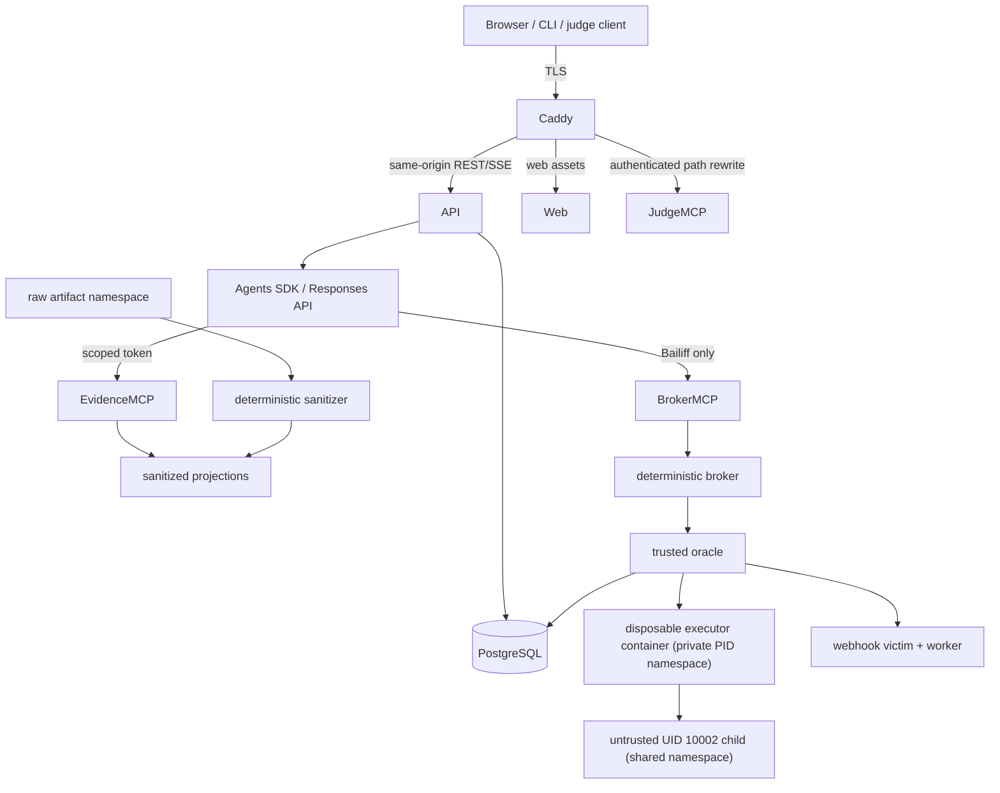

# CrossPatch threat model

## Scope

This model covers the shipped Docker Compose sandbox: Caddy, Next.js web UI,
FastAPI control plane, PostgreSQL, the three MCP services, five OpenAI Agents SDK
specialists, the mutation broker, trusted runner, disposable candidate executor
container and its untrusted demoted child,
webhook victim/worker, CLI, artifact store, and incident exports.

The protected outcomes are simple: no mutation without exact human approval; no
model or candidate code gains mutation/test/oracle authority; no raw or cross-
incident evidence reaches a model or judge; no failed or incomplete safety review
becomes approval; and every public claim remains traceable to generated evidence.

## Assets

| Asset | Required property |
| --- | --- |
| Human approval and nonce | Exact, single-use, expiring, non-replayable |
| Canonical warrant | Complete and byte-bound to reviewed inputs and operations |
| Sandbox worktree | Unchanged until broker validates approval |
| Oracle/test receipt | Produced only from trusted external observation |
| Raw evidence | Private, integrity checked, never model/public readable |
| Sanitized/published evidence | Publication bounded, provenance preserving, injection tagged |
| Event timeline | Append-only, ordered, hash chained |
| Judge/operator credentials | Hashed or private, scoped, revocable, expiry enforced |
| Signing keys and manifests | Confidential keys; verifiable public artifacts |
| Release claims | Backed by non-empty generated artifacts and SHA-256 |

## Trust boundaries and data flow



Boundary assumptions:

- The host, kernel, Docker daemon, pinned base-image registry, OpenAI API, and
  deployment operator are trusted dependencies.
- Model output, candidate code, webhook payloads, source, logs, diffs, comments,
  and test output are untrusted.
- Private networking reduces exposure but does not authorize a request. Every MCP
  request still validates audience, subject, Host, Origin, replay ID, expiry, and
  principal/session binding.
- A model safety guardrail is defense in depth. The deterministic state machine
  and broker are the authority boundary.

## Primary abuse cases and controls

### A model attempts to mutate or select commands

**Attack:** An output asks for a shell, supplies argv, edits a file, or invokes a
non-allowlisted tool.

**Controls:** Agents receive no filesystem, shell, test, or mutation tool. The
Bailiff receives only `execute_warrant(id)`. Fixed plans live in an immutable
catalog outside the candidate tree. Model-authored argv and unknown IDs are
rejected. The broker resolves operations from the approved document itself.

### A refusal or partial safety response is interpreted as approval

**Attack:** Sol refuses, times out, is cut off, emits invalid JSON, omits evidence,
or returns an unknown verdict.

**Controls:** The failure taxonomy deterministically maps all such outcomes to
`ABSTAIN`; the state moves to human escalation, appends the reason, creates no
warrant, disables approval, and invokes neither Bailiff nor broker. Only a typed,
cited `CLEAR` can enter pending approval.

### Log-based prompt injection changes specialist behavior

**Attack:** Logs or source include direct/encoded instructions, fake roles/tool
calls, Unicode controls, or secrets.

**Controls:** Raw evidence remains in a private content-addressed namespace.
Deterministic sanitization normalizes controls, tags instruction-like regions,
redacts secrets, and enforces limits before a typed `UNTRUSTED_EVIDENCE` envelope
is built. Models have read-only tools and cannot turn content into authority.
Citation/output validation and the broker remain independent.

**Residual risk:** Novel or semantic instructions may evade tagging. Sanitizer
limitations are explicit; sanitation never grants trust or mutation capability.

### Candidate code forges a successful test

**Attack:** A patch calls `os._exit(0)`, prints a pass message, changes tests,
modifies trusted context, steals a secret, or writes the result receipt.

**Controls:** Candidate execution is an irreversibly demoted UID/GID 10002 child
with no supplementary groups or capabilities and a read-only source mount. The
child shares the disposable executor container's private PID namespace; it does
not have a separate namespace. The entire executor container is recycled after
each attempt, and no receipt is returned until the runner authenticates a new
boot. The child has no oracle context, Docker socket, control-socket path access,
or trusted receipt mount. Fixed tests and runner code are root-owned and outside
the candidate tree. The trusted runner makes signed HTTP requests, observes
PostgreSQL locks/counts externally, snapshots the tree/context, and authors the
receipt. Candidate stdout and exit zero are not proof of a passing invariant.

### Approval is replayed or the reviewed patch changes

**Attack:** Reuse a nonce, race two executions, modify one patch byte/path/command,
swap the base SHA or verdict, extend expiry, or present a stale UI hash.

**Controls:** The UI/CLI posts the displayed warrant hash with approver, Origin,
CSRF, and step-up checks. The broker recomputes the canonical hash and validates
every bound predicate under one database transaction using database time. A
unique consumed nonce and row locks make concurrent replay fail. Any mismatch,
expiry, revocation, or dependency error rejects before mutation.

### Cross-incident or raw evidence leaks

**Attack:** Guess an ID/hash, manipulate SSE replay, export another incident,
request a raw path, or use Judge MCP resource templates to cross boundaries.

**Controls:** API principals contain explicit incident IDs and reject wildcard
authorization. REST/SSE/export queries authorize before lookup. Judge MCP has a
different boundary: its database reader selects only durable projections whose
`published` bit was set only by the operator-case transaction that entered the
terminal `VERIFIED` state. Live-trial incidents never set that bit, including
after successful sandbox verification, and cannot be read through Judge MCP.
One
authenticated Judge bearer intentionally browses all such published cases; an
optional non-default mode additionally binds it to one incident. In-flight,
failed, and otherwise unpublished projections are absent from every Judge query.
Raw and sanitized stores use separate roots and typed accessors; no generic
raw-hash API exists. Exports contain only published sanitized artifacts and a
signed manifest.
The verifier rejects traversal, symlinks, duplicates, unmanifested/cross-incident
members, signature mismatch, and archive bombs without extracting.

### Judge credential is stolen or availability ends early

**Attack:** Read a plaintext token from storage, replay it across MCP sessions,
or rotate/restart in a way that cuts access before winners are announced.

**Controls:** Judge tokens are shown once, stored as hashes, audience scoped,
session bound, revocable, and validated against a minimum expiry of
`2026-08-13T07:00:00Z`. The registered Judge bearer intentionally supports
replacement MCP sessions so disconnects and restarts do not end required judge
access; registry revocation is checked on every request. Evidence and Broker
bearer tokens remain single-session with replay tombstones. A stolen bearer can
open read-only Judge sessions until it is revoked, so TLS, separate secure
delivery, short incident response, and overlapping rotation remain required.
Persistent database/secret volumes survive restart. Uptime and TLS renewal are
monitored.

The default Judge bearer is publication-bounded, not incident-bound. Theft can
therefore disclose every explicitly published case until revocation, but it
still cannot disclose in-flight incidents, raw evidence, secrets, or any control
or mutation capability. Deployments that need narrower sharing may set
`CROSSPATCH_JUDGE_INCIDENT_SCOPED=1` and issue a token for one incident.

### Live-trial credential abuse or budget multiplication

**Attack:** Reuse one trial bearer across incidents, decide another subject's
warrant, issue many credentials to multiply a per-token allowance, or try to
move a verified trial into the shared Judge browse set.

**Controls:** A digest-only live-trial principal is durably bound to incidents
it creates. Every read and decision checks that ownership before lookup or
mutation. Each credential has an independent rate window, while one locked
singleton budget reserves and reconciles model spend across all credentials;
new credentials do not create new allowance. Trial execution selects only the
bundled immutable candidate plan and existing sandbox path. Trial origin is not
API-updatable, `VERIFIED` is terminal, and publication explicitly requires a
non-trial operator incident.

### Published evidence or claims are fabricated

**Attack:** Seed an expected failure, hand-write a pass artifact, edit an artifact
after verification, or claim hosted/real-model readiness without credentials.

**Controls:** The sample path calls the real API and victim; it cannot insert
evidence/model output directly. Verification artifacts state their checked-in
generator, command, timestamp, source, and SHA-256. `CLAIM_MAP.json` is generated
from the artifacts and hash checked. Missing OpenAI credentials yields zero model
runs and `DEMO_READINESS_BLOCKED`; missing hosting authority yields
`HOSTED_DEPLOYMENT_BLOCKED`. Neither is converted to a success.

## Service hardening matrix

| Service | Public port | Root filesystem | Identity | Authority |
| --- | --- | --- | --- | --- |
| Caddy | 80/443 | read-only | UID 0, only `NET_BIND_SERVICE`, NNP | TLS and exact reverse proxy routes |
| Web | none | read-only | numeric non-root | UI rendering only |
| API | none | read-only | numeric non-root | authenticated control plane |
| Evidence MCP | none | read-only | numeric non-root | sanitized incident reads |
| Judge MCP | none | read-only | numeric non-root | published read-only projection |
| Broker MCP | none | read-only | numeric non-root | one warrant ID tool |
| Runner | none | read-only + tmpfs jobs | UID 10001 | trusted oracle and receipt |
| Candidate child | none | executor read-only root + tmpfs | UID/GID 10002, no groups/caps | fixed candidate execution only |
| Victim/worker | none | read-only + tmpfs | numeric non-root | disposable sandbox behavior |
| PostgreSQL | none | persistent data volume | image postgres user | durable events/approvals/test data |

The executor bootstrap retains only `KILL`, `SETGID`, and `SETUID`; Caddy runs
as UID 0 with only `NET_BIND_SERVICE`; every other hardened service drops all
capabilities. All enter `no-new-privileges` before application or candidate
code, avoid host PID or privileged mode, and mount no container-runtime socket.

## Security verification

Run:

```bash
uv run pytest backend/tests/security -q
uv run pytest backend/tests/integration/test_broker.py \
  backend/tests/integration/test_broker_postgres.py -q
docker compose config
./scripts/verify-release.sh --strict
```

The release gate also verifies negative approval paths, container policy,
sanitizer vectors, MCP allowlists, export tampering, generated claim hashes, and
the honest external readiness states.

## Out of scope

- Mutating a real production repository or infrastructure.
- Multi-tenant internet service hardening and regulatory compliance.
- Kernel/VM isolation from a hostile container escape.
- Automated deploy, merge, rollback, or production remediation.
- Long-term secret management beyond the documented persistent-volume prototype.
- Claiming the sanitizer can determine semantic safety of arbitrary text.
